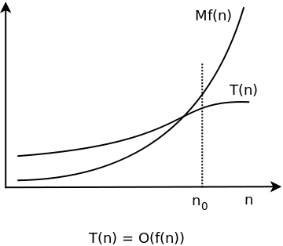

Related
-------

[Time complexity explained](time-complexity-explained.html)  
Programming.Guide

[Amortized time complexity](amortized-time-complexity-analysis.html)  
Programming.Guide

Top Algorithm Articles
----------------------

1.  [Dynamic programming vs memoization vs tabulation](dynamic-programming-vs-memoization-vs-tabulation.html)
2.  Big O notation explained
3.  [Sliding Window Algorithm with Example](sliding-window-example.html)
4.  [What makes a good loop invariant?](what-makes-a-good-loop-invariant.html)
5.  [Generating a random point within a circle (uniformly)](random-point-within-circle.html)

[**See all algorithm articles**](algorithms.html)

Top Java Articles
-----------------

1.  [Do interfaces inherit from Object?](java/do-interfaces-inherit-from-object.html)
2.  [Executing code in comments?!](java/executing-code-in-comments.html)
3.  [Functional Interfaces](java/functional-interfaces.html)
4.  [Handling InterruptedException](java/handling-interrupted-exceptions.html)
5.  [Why wait must be called in a synchronized block](java/why-wait-must-be-in-synchronized.html)

[**See all Java articles**](java/index.html)

Big O notation explained
========================

Big O notation is a convenient way to describe how fast a function is growing.

When studying the time complexity T(*n*) of an algorithm it's rarely meaningful, or even possible, to compute an exact result. Typically we are only interested in how fast T(*n*) is growing as a function of the input size *n*.

For example, if an algorithm increments each number in a list of length *n*, we might say: "This algorithm runs in O(*n*) time and performs O(1) work for each element".

**Definition:** Let T(*n*) and f(*n*) be two positive functions. We write **T(*n*) ∊ *O*(f(*n*))**, and say that T(*n*) has order of f(*n*), if there are positive constants M and n₀ such that T(*n*) ≤ M·f(*n*) for all *n* ≥ n0.

Basically, T(*n*) ∊ *O*(f(*n*)) means that T(*n*) doesn't grow faster than f(*n*).

Constant time
-------------

Let's start with the simplest possible example: **T(*n*) ∊ *O*(1)**.

According to the definition this means that there are constants M and n0 such that T(*n*) ≤ M when *n* ≥ n0. In other words, T(*n*) ∊ *O*(1) means that T(*n*) is smaller than some fixed constants, whose value isn't stated, for all large enough values of *n*.

An algorithm with T(*n*) ∊ *O*(1) is said to have **constant time complexity**.

Linear time
-----------

In [Time complexity explained](time-complexity-explained.html) we looked at an algorithm `max` with time complexity T(*n*) = *n* -1. Using Big O notation this can be written as **T(*n*) ∊ *O*(*n*)**. (If we choose M = 1 and n₀ = 1, then T(*n*) = *n* - 1  ≤ 1·*n* when *n* ≥ 1.)

An algorithm with T(*n*) ∊ *O*(*n*) is said to have **linear time complexity**.

Quadratic time
--------------

The algorithm `reverse` from [Time complexity explained](time-complexity-explained.html) had time complexity T(*n*) = *n*2/2 - *n*/2. With Big O notation, this becomes **T(*n*) ∊ *O*(*n*2)**, and we say that the algorithm has **quadratic time complexity**.

Sloppy notation
---------------

The notation T(*n*) ∊ *O*(f(*n*)) can be used even when f(*n*) grows **much faster** than T(*n*). For example, we may write T(*n*) = *n* - 1 ∊ *O*(*n*2). This is indeed true, but not very useful.

Ω and Θ notation
----------------

**Big Omega** is used to give a **lower bound** for the growth of a function. It's defined in the same way as Big O, but with the inequality sign turned around:

**Definition:** Let T(*n*) and f(*n*) be two positive functions We write **T(*n*) ∊ Ω(f(*n*))**, and say that T(*n*) is big omega of f(*n*), if there are positive constants m and n₀ such that T(*n*) ≥ m(f(*n*)) for all *n* ≥ n₀.

**Big Theta** is used to indicate that an function is bounded both from above and below:

**Definition:** T(*n*): ∊ Θ(f(*n*)) if T(*n*) is both *O*(f(*n*)) and Ω(f(*n*)).

**Example:** T(*n*) = 3*n*3 + 2*n* + 7 ∊ Θ(*n*3)

-   If *n* ≥ 1, then T(*n*) = 3*n*3 + 2*n* + 7 ≤ 3*n*3 + 2*n*3 + 7*n*3 = 12*n*3. Hence T(*n*) ∊ *O*(*n*3).
-   On the other hand, T(*n*) = 3*n*3 + 2*n* + 7 &gt; *n*3 for all positive *n*. Therefore T(*n*) ∊ Ω(*n*3).
-   And consequently T(*n*) ∊ Θ(*n*3).

Key takeaways
-------------

When analyzing algorithms you often encounter the following time complexities (in order of growth):

-   Θ(1)
-   Θ(log *n*)
-   Θ(*n*)
-   Θ(*n* log *n*)
-   Θ(*n*k), where k ≥ 2
-   Θ(k*n*), where k ≥ 2
-   Θ(*n*!)

The first four indicate an excellent algorithm:

***O*(*n* log *n*) is really good**

An algorithm with worst-case time complexity W(*n*) ∊ *O*(*n* log *n*) scales very well. The logarithm function grows very slowly:

-   log2 1,000 ≈ 10,
-   log2 1,000,000 ≈ 20,
-   log2 1,000,000,000 ≈ 30.

In fact, *O*(*n* log *n*) time complexity is close to linear: it takes roughly twice the time to solve a problem twice as big.

The last three typically spell trouble:

**Ω(*n*2) is pretty bad**

Algorithms with time complexity Ω(*n*2) are useful only for small input: *n* shouldn't be more than a few thousand:

-   10,0002 = 100,000,000.

An algorithm with quadratic time complexity scales poorly: if you increase the input size by a factor 10, the time increases by a factor 100.

Comments
--------

Be the first to comment!

© 2016–2021 Programming.Guide, [Terms and Conditions](terms-and-conditions.html)
