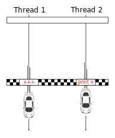

Further Reading
---------------

[Off to the Races](https://research.swtch.com/gorace)  
by Russ Cox

Concurrency in Go
-----------------

1.  [Goroutines explained](goroutines-explained.html)
2.  [Channels explained](channels-explained.html)
3.  [Select explained](select-explained.html)
4.  Data races explained
5.  [Detect data races](detect-data-races.html)
6.  [Deadlock](detect-deadlock.html)
7.  [Wait for goroutines](wait-for-goroutines-waitgroup.html)
8.  [Broadcast a signal on a channel](broadcast-channel.html)
9.  [Stop a goroutine](stop-goroutine.html)
10. [Timer and Ticker explained](time-reset-wait-stop-timeout-cancel-interval.html)
11. [Mutual exclusion lock (mutex)](mutex-explained.html)
12. [Efficient parallel computation](efficient-parallel-computation.html)

Top Algorithm Articles
----------------------

1.  [Dynamic programming vs memoization vs tabulation](../dynamic-programming-vs-memoization-vs-tabulation.html)
2.  [Big O notation explained](../big-o-notation-explained.html)
3.  [Sliding Window Algorithm with Example](../sliding-window-example.html)
4.  [What makes a good loop invariant?](../what-makes-a-good-loop-invariant.html)
5.  [Generating a random point within a circle (uniformly)](../random-point-within-circle.html)

[**See all articles**](../index.html)

Go: Data races explained
========================

A **data race** happens when two goroutines access the same variable concur­rently, and at least one of the accesses is a write.

The output of the program is subject to scheduling.

Data races can easily be introduced by mistake and often result in situations that are hard to debug.

The function below has a data race and it's behavior is not deterministic. It may, for example, print the number 1. Try to figure out how that can happen. One possible explanation comes after the code.

    func race() {
            wait := make(chan struct{})
            n := 0
            go func() {
                    n++ // read, increment, write
                    close(wait)
            }()
            n++ // conflicting access
            <-wait
            fmt.Println(n) // Output: ?
    }

The two goroutines, g1 and g2, participate in a race and there is no way to know in which order the operations will take place. The following is one out of many possible outcomes.

<table><thead><tr class="header"><th>g1</th><th>g2</th></tr></thead><tbody><tr class="odd"><td>Read the value 0 from <code>n</code>.</td><td></td></tr><tr class="even"><td></td><td>Read the value 0 from <code>n</code>.</td></tr><tr class="odd"><td>Incre­ment value from 0 to 1.</td><td></td></tr><tr class="even"><td>Write 1 to <code>n</code>.</td><td></td></tr><tr class="odd"><td></td><td>Incre­ment value from 0 to 1.</td></tr><tr class="even"><td></td><td>Write 1 to <code>n</code>.</td></tr><tr class="odd"><td>Print <code>n</code>, which is now 1.</td><td></td></tr></tbody></table>

The name "data race" is somewhat misleading. Not only is the scheduling of different threads undefined; instructions within a single thread may even be reordered! Here's what the spec says:

> Within a single goroutine, reads and writes must behave as if they executed in the order specified by the program. That is, compilers and processors may reorder the reads and writes executed within a single goroutine only when the reordering does not change the behavior within that goroutine as defined by the language specification. Because of this reordering, the execution order observed by one goroutine may differ from the order perceived by another. For example, if one goroutine executes `a = 1; b = 2;`, another might observe the updated value of `b` before the updated value of `a`. <a href="https://golang.org/ref/mem" class="quote-source">The Go Memory Model: Happens Before</a>

In addition to this type of instruction reordering, a thread is allowed to **cache** previously read values until the next synchronization point. This means for instance that a snippet like `for !done { }` (that never synchronizes) may continue looping for ever, even if another thread sets `done` to `true`.

It gets worse. Reads and writes of values larger than a single machine word behave as multiple machine-word-sized operations. This means that a thread could read a variable and, if unlucky, observe a value that has never been written to that variable.

While the above gives rise to surprising behaviors in multithreaded programs, it allows for optimizations and more efficient execution of individual threads.

**Conclusion**: it's *very* hard to reason about programs with data races.

How to avoid data races
-----------------------

The only way to avoid data races is to synchronize access to all mutable data that is shared between threads. There are several ways to achieve this. In Go, you would normally use a **channel** or a **lock**. (Lower-lever mechanisms are available in the [`sync`](https://golang.org/pkg/sync/) and [`sync/atomic`](https://golang.org/pkg/sync/atomic/) packages.)

The preferred way to handle concurrent data access in Go is to use a channel to pass the actual data from one goroutine to the next. The motto is: "Don’t communicate by sharing memory; share memory by communicating."

    func sharingIsCaring() {
            ch := make(chan int)
            go func() {
                    n := 0 // A local variable is only visible to one goroutine.
                    n++
                    ch <- n // The data leaves one goroutine...
            }()
            n := <-ch // ...and arrives safely in another goroutine.
            n++
            fmt.Println(n) // Output: 2
    }

In this code the channel does double duty:

-   it passes the data from one goroutine to another,
-   and it acts as a point of synchronization.

The sending goroutine will wait for the other goroutine to receive the data and the receiving goroutine will wait for the other goroutine to send the data.

« Prev

Select explained

TOC

Concurrency in Go

4 of 12

Next »

Detect data races

Comments
--------

Be the first to comment!

© 2016–2021 Programming.Guide, [Terms and Conditions](../terms-and-conditions.html)
