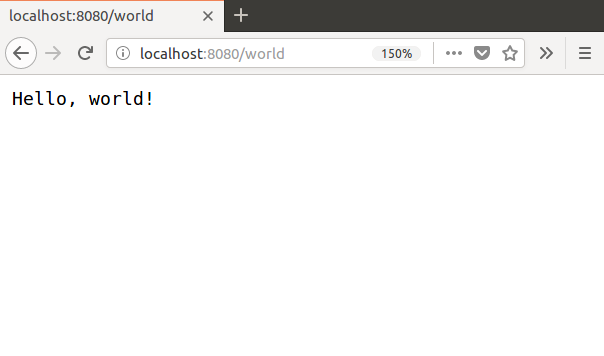

Top Go Articles
---------------

1.  [Go gotcha](go-gotcha.html)
2.  [String handling cheat sheet](string-functions-reference-cheat-sheet.html)
3.  [Maps explained](maps-explained.html)
4.  [For loops explained](for-loop.html)
5.  [Concurrent programming](go-concurrency-tutorial.html)

[**See all 197 Go articles**](index.html)

Top Algorithm Articles
----------------------

1.  [Dynamic programming vs memoization vs tabulation](../dynamic-programming-vs-memoization-vs-tabulation.html)
2.  [Big O notation explained](../big-o-notation-explained.html)
3.  [Sliding Window Algorithm with Example](../sliding-window-example.html)
4.  [What makes a good loop invariant?](../what-makes-a-good-loop-invariant.html)
5.  [Generating a random point within a circle (uniformly)](../random-point-within-circle.html)

[**See all articles**](../index.html)

Go: HTTP server example
=======================

If you run the program below and access the URL `http://localhost:8080/world`, you will be greated by this page:

    package main

    import (
        "fmt"
        "net/http"
    )

    func main() {
        http.HandleFunc("/", HelloServer)
        http.ListenAndServe(":8080", nil)
    }

    func HelloServer(w http.ResponseWriter, r *http.Request) {
        fmt.Fprintf(w, "Hello, %s!", r.URL.Path[1:])
    }

-   The call to [`http.HandleFunc`](https://golang.org/pkg/net/http/#HandleFunc) tells the [`net.http`](https://golang.org/pkg/net/http/) package to handle all requests to the web root with `HelloServer`.
-   The call to [`http.ListenAndServe`](https://golang.org/pkg/net/http/#ListenAndServe) tells the server to listen on the TCP network address `:8080`. This function blocks until the program is terminated.
-   Writing to an [`http.ResponseWriter`](https://golang.org/pkg/net/http/#ResponseWriter) sends data to the HTTP client.
-   An [`http.Request`](https://golang.org/pkg/net/http/#Request) is a data structure that represents a client HTTP request.
-   `r.URL.Path` is the path component of the request URL; the path component of `http://localhost:8080/world` is `/world`.

Further reading
---------------

The [Writing Web Applications](https://golang.org/doc/articles/wiki/) tutorial shows how to extend this small example into a complete wiki.

The tutorial covers how to:

-   create a data structure with load and save methods,
-   use the [`net/http`](https://golang.org/pkg/net/http/) package to build web applications,
-   use the [`html/template`](https://golang.org/pkg/html/template/) package to process HTML templates,
-   use the [`regexp`](https://golang.org/pkg/regexp/) package to validate user input.

Comments
--------

Be the first to comment!

© 2016–2021 Programming.Guide, [Terms and Conditions](../terms-and-conditions.html)
