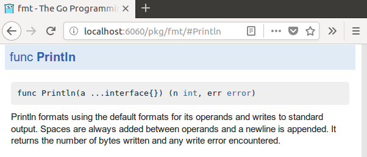

## Further reading

[Packages explained](packages-explained.html)  
Programming.Guide

[Godoc: documenting Go code](https://blog.golang.org/godoc-documenting-go-code)  
The Go Blog

[Effective Go: Commentary](https://golang.org/doc/effective_go.html#commentary)  
golang.org

[Package names](https://blog.golang.org/package-names)  
The Go Blog

[Testable Examples in Go](https://blog.golang.org/examples)  
The Go Blog

[Package testing: examples](https://golang.org/pkg/testing/#hdr-Examples)  
golang.org

## Top Go Articles

1.  [Go gotcha](go-gotcha.html)
2.  [String handling cheat sheet](string-functions-reference-cheat-sheet.html)
3.  [Maps explained](maps-explained.html)
4.  [For loops explained](for-loop.html)
5.  [Concurrent programming](go-concurrency-tutorial.html)

[**See all 197 Go articles**](index.html)

## Top Algorithm Articles

1.  [Dynamic programming vs memoization vs tabulation](../dynamic-programming-vs-memoization-vs-tabulation.html)
2.  [Big O notation explained](../big-o-notation-explained.html)
3.  [Sliding Window Algorithm with Example](../sliding-window-example.html)
4.  [What makes a good loop invariant?](../what-makes-a-good-loop-invariant.html)
5.  [Generating a random point within a circle (uniformly)](../random-point-within-circle.html)

[**See all articles**](../index.html)

# Go: Package documentation

The [GoDoc](https://godoc.org/) website hosts docu­men­tation for Go packages on Bitbucket, GitHub, Google Project Hosting and Launchpad:

- [`https://godoc.org/fmt`](https://godoc.org/fmt)
- [`https://godoc.org/math/rand`](https://godoc.org/math/rand)
- [`https://godoc.org/github.com/yourbasic/graph`](https://godoc.org/github.com/yourbasic/graph)

## Godoc command

The [godoc](https://godoc.org/golang.org/x/tools/cmd/godoc) command extracts and generates documentation for all locally installed Go programs, both your own code and the standard libraries.

The command

    $ godoc -http=:6060 &

starts a web server that presents the documentation at `http://localhost:6060/`:

The documentation is tightly coupled with the code. For example, you can navigate from a function's documentation to its implementation with a single click.

Without the `-http` flag, `godoc` prints plain text documentation to standard output:

    $ godoc fmt Println
    func Println(a ...interface{}) (n int, err error)
        Println formats using the default formats for its operands and writes to
        standard output. Spaces are always added between operands and a newline
        is appended. It returns the number of bytes written and any write error
        encountered.

## Create documentation

To document a function, type, constant, variable, or even a complete package, write a regular comment directly preceding its declaration, with no blank line in between. For example, this is the documentation for the [`fmt.Println`](https://golang.org/src/fmt/print.go?s=7388:7437#L246) function:

    // Println formats using the default formats for its operands and writes to standard output.
    // Spaces are always added between operands and a newline is appended.
    // It returns the number of bytes written and any write error encountered.
    func Println(a ...interface{}) (n int, err error) {
    …

For best practices on how to document Go code, see [Effective Go: Commentary](https://golang.org/doc/effective_go.html#commentary).

## Godoc examples

You can add example code snippets to the package documentation; this code is verified by running it as a test. For more information on how to create such testable examples, see [The Go Blog: Testable Examples in Go](https://blog.golang.org/examples).

## Comments

Be the first to comment!

© 2016–2021 Programming.Guide, [Terms and Conditions](../terms-and-conditions.html)
