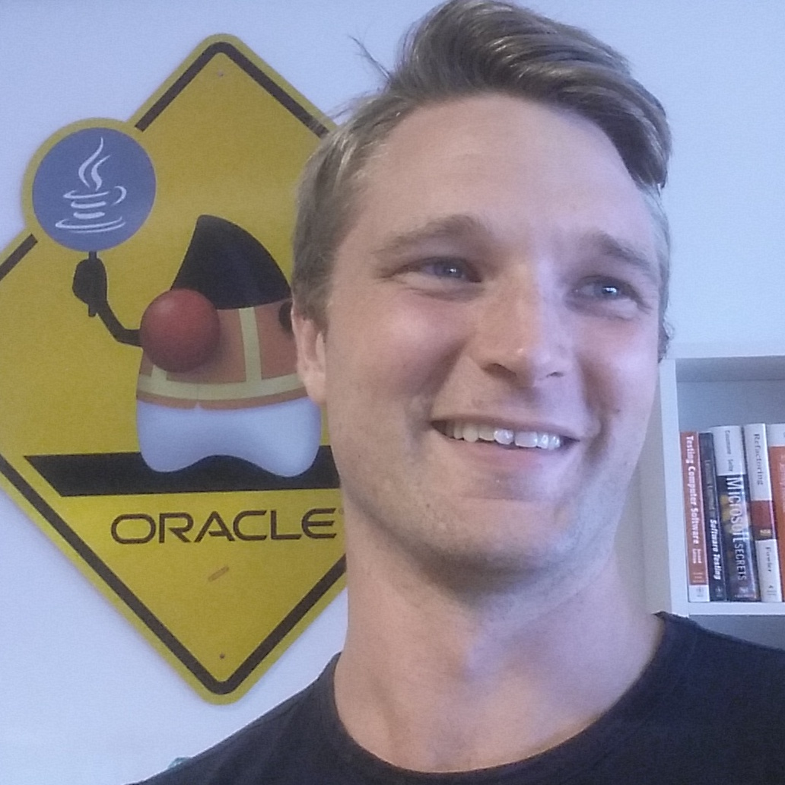

## Top Java Articles

1.  [Do interfaces inherit from Object?](java/do-interfaces-inherit-from-object.html)
2.  [Executing code in comments?!](java/executing-code-in-comments.html)
3.  [Functional Interfaces](java/functional-interfaces.html)
4.  [Handling InterruptedException](java/handling-interrupted-exceptions.html)
5.  [Why wait must be called in a synchronized block](java/why-wait-must-be-in-synchronized.html)

## Top Go Articles

1.  [Go gotcha](go/go-gotcha.html)
2.  [String handling cheat sheet](go/string-functions-reference-cheat-sheet.html)
3.  [Maps explained](go/maps-explained.html)
4.  [For loops explained](go/for-loop.html)
5.  [Concurrent programming](go/go-concurrency-tutorial.html)

## Top Algorithm Articles

1.  [Dynamic programming vs memoization vs tabulation](dynamic-programming-vs-memoization-vs-tabulation.html)
2.  [Big O notation explained](big-o-notation-explained.html)
3.  [Sliding Window Algorithm with Example](sliding-window-example.html)
4.  [What makes a good loop invariant?](what-makes-a-good-loop-invariant.html)
5.  [Generating a random point within a circle (uniformly)](random-point-within-circle.html)

# Programming.Guide

Articles on Programming Guide strive to…

- …put examples up front
- …be of highest possible quality
- …be concise and to the point
- …the reader should not have to look further in the search results
- …the reader should as quickly as possible be unblocked and be able to switch back to his/her IDE and continue programming

Currently serving **430** articles on [Java](java/index.html), [Go](go/index.html) and [algorithms](algorithms.html).

## Authors

**Andreas Lundblad**, PhD in theoretical computer science. Worked for three years at Oracle developing the Java platform (javac, javadoc, sjavac). Andreas is among the [top 10 contributors](http://stackoverflow.com/tags/java/topusers) in the Java tag at Stack Overflow and 7th highest rated StackOverflow user according to [StackRating.com](https://stackrating.com/user/276052).

**Stefan Nilsson** is an [associate professor](https://www.nada.kth.se/~snilsson/) of Computer Science at the Royal Institute of Technology. Stefan has taught programming and algorithms for over two decades and is a contributor to the Go project.

## Background

Back in the days there was a popular site called [Example Depot](http://web.archive.org/web/20120113091817/http://www.exampledepot.com/). It was a great resource for ready-to-use code snippets, conveniently available for copy/paste. It was also straight to the point with example code up front.

  
Example Depo around 2010.

The site died and along came Stack Overflow which is now the dominant online resource for programmers. Stack Overflow is great, the founder of Programming.Guide is in fact among the top 100 contributors. But Stack Overflow has its drawbacks. The quality is not what you'd like it to be, and the best answer is not always found at the top. It's also entirely problem / solution oriented as opposed to example snippets / "cookbook" oriented as Example Depot was. An attempt to cover this niche was made with [Stack Overflow Docs](http://www.stackoverflow.com/documentation). The philosophy behind SO Docs was good; concise and to-the-point articles with examples-first. It failed to deliver however, and the project was [discontinued](https://meta.stackoverflow.com/questions/354217/sunsetting-documentation) in August 2017.

Programming.Guide site is an effort to cover the nische that Example Depot once did. The ambition is to provide high quality articles on the subject of programming. Quality and examples up front is the mantra. Initially the focus is on Java and Go fundamentals since that's the domain of expertise of the current authors.

© 2016–2021 Programming.Guide, [Terms and Conditions](terms-and-conditions.html)
