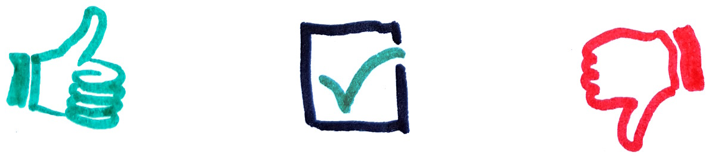

## External resources

[Effective Java Exceptions](http://www.oracle.com/technetwork/java/effective-exceptions-092345.html)  
by Barry Ruzek

[Vexing exceptions](https://blogs.msdn.microsoft.com/ericlippert/2008/09/10/vexing-exceptions/)  
by Eric Lippert

[Failure and Exceptions, A Conversation with James Gosling](http://www.artima.com/intv/solid.html)  
by Bill Venners

[Effective Java, Item 71: Avoid unnecessary use of checked exceptions](https://books.google.se/books?id=BIpDDwAAQBAJ)  
by Joshua Bloch

## Top Java Articles

1.  [Do interfaces inherit from Object?](do-interfaces-inherit-from-object.html)
2.  [Executing code in comments?!](executing-code-in-comments.html)
3.  [Functional Interfaces](functional-interfaces.html)
4.  [Handling InterruptedException](handling-interrupted-exceptions.html)
5.  [Why wait must be called in a synchronized block](why-wait-must-be-in-synchronized.html)

[**See all 190 Java articles**](index.html)

## Top Algorithm Articles

1.  [Dynamic programming vs memoization vs tabulation](../dynamic-programming-vs-memoization-vs-tabulation.html)
2.  [Big O notation explained](../big-o-notation-explained.html)
3.  [Sliding Window Algorithm with Example](../sliding-window-example.html)
4.  [What makes a good loop invariant?](../what-makes-a-good-loop-invariant.html)
5.  [Generating a random point within a circle (uniformly)](../random-point-within-circle.html)

# Checked Exceptions: Good or Bad?

Checked exceptions is a somewhat controversial feature that forces programmers to acknoledge the fact that an exception may be thrown, either by catching it or by explicitly alowing it to propagate up the call stack. The creators of C\# chose to leave this feature out, while many Java supporters argue that it's a useful feature contributing to more resiliant software.

## Pros

- **Fail-Fast Development**: Exceptional situations, such as possible IO errors, surface at compile time. Ignoring an unchecked exception becomes a concious decision as opposed to, for example, custom return values indicating errors, or unchecked exceptions.
- **Contract**: The fact that a method throws a certain exception can be an essential part of the contract. The `throws` declaration is therefore as important as the types of the return value and parameters. Apart from the static analysis it enables, it also serves a documentational purpose for the programmer.

## Cons

- **Extensibility**: You can't add `throws SomeCheckedException` to a method signature without breaking client code, wihch restricts the evolution of APIs. You're obliged to either throw an unchecked exception (even it otherwise has the characteristics of a checked exception) or create a new method and deprecate the original one.
- **Misuse**: Many checked exceptions, including some in the the Java API, should have been implemented as unchecked exceptions. Such misuse leads to frustration and in the end catch blocks that either ignores them or rethrows them as `RuntimeException`s which in turn are never caught.
- **Propagation**: One key feature of exceptions is that they can be thrown at a low level, bubbled up and dealt with at a high level---"throw early, catch late". The issue with checked exceptions is that every intermediate level needs to declare the exception to be thrown. This is particularly problematic when the intermediate levels include interfaces that doesn't allow checked exceptions to be thrown.

This problem arises all the time with callbacks, as the API accepting a callback doesn't know what exceptions the client might want to throw. To give an example, here's a snippet that uses the Stream API:

    long calculateBlogDiskSize() {
        try {
            return blogEntries
                    .stream()
                    .mapToLong(e -> Files.size(e.sourceFile))
                    .sum();
         } catch (IOException e) {
             throw new BlogSizeCalcException(e);
         }
     }

This doesn't compile since [`Files.size`](https://docs.oracle.com/javase/8/docs/api/java/nio/file/Files.html#size-java.nio.file.Path-) throws `IOException` which is not allowed to propagate through [`ToLongFunction`](https://docs.oracle.com/javase/8/docs/api/java/util/function/ToLongFunction.html#applyAsLong-T-). It's not unreasonable to view lambdas and the Stream API as alternative control flow structures. Imagine if checked exceptions worked as poorly with `for` as it does with [`forEach`](https://docs.oracle.com/javase/8/docs/api/java/util/stream/Stream.html#forEach-java.util.function.Consumer-)!

## Regarding Extensibility

Not being able to add `throws SomeCheckedException` to an interface without breaking existing code is both a drawback and a benefit. As mentioned in the beginning, the throws declaration is an essential part of the method contract, and I think most programmers would agree that it would be terrible if the compiler didn't complain about changes to other parts of the contract, such as the return type.

## Regarding Misuse

Many people recognize that exceptional situations can be divided into two groups. Barry Ruzek refer to these as [_Faults_ and _Contingencies_](http://www.oracle.com/technetwork/articles/entarch/effective-exceptions2-097044.html):

- **Contingencies** are out of the ordinary but not unexpected. A user entered a text string when asked for a number, or a configuration file was not found on disk.
- **Faults** are due to conditions out of the control of the program (someone unplugged the network cable, the computer ran out of memory) or conditions that the programmer was unaware of when writing the code (a method returned `null` while the code expects a string).

Most people stop here, and say that faults should be dealt with by throwing unchecked exceptions and the contingencies with checked exceptions. This causes a lot of frustration and is the reason for a lot the bad reputation attributed to checked exceptions.

There's another dimension to consider as well:

- **Unpredictable** situations that client code can't forsee or do anything to avoid
- **Predictable** situations that are statically forseeable and possible for the client to avoid

Putting these together results in the following taxonomy of exceptional situations:

<table><colgroup><col style="width: 33%" /><col style="width: 33%" /><col style="width: 33%" /></colgroup><tbody><tr class="odd"><td></td><td style="text-align: center;">Unpredictable</td><td style="text-align: center;">Predictable</td></tr><tr class="even"><td>
Cont.
</td><td style="text-align: center;">Rare but normal situations due to conditions external to the code, such as a network outage or a file system issue.<ul><li><code>FileNotFoundException</code></li><li><code>PrinterException</code></li><li><code>SocketTimeoutException</code></li></ul></td><td style="text-align: center;">Situations that are out of the ordinary but not <em>exceptional</em> per se.<ul><li><code>IllegalArgumentException</code></li><li><code>NumberFormatException</code></li><li><code>MalformedURLException</code></li></ul></td></tr><tr class="odd"><td>
Fault
</td><td style="text-align: center;">Failures due to external conditions. These are hard for the code to do something about, and in some cases it's even a bad idea to try.<ul><li><code>OutOfMemoryError</code></li><li><code>StackOverflowError</code></li><li><code>NoSuchMethodError</code></li></ul></td><td style="text-align: center;">Prorgamming errors. These situations are due to bugs and should never have occurred in the first place.<ul><li><code>ArrayIndexOutOfBounds</code></li><li><code>NullPointerException</code></li><li><code>ArithmeticException</code></li></ul></td></tr></tbody></table>

Frustration arises when checked exceptions are used to handle _predictable_ control flow. Consider for instance:

    try {
        int rnd = new Random().nextInt(8);
        URL url = new URL("http://mirror" + rnd + ".example.com");
        // ...
    } catch (MalformedURLException e) {
        // Unreachable
    }

There's no point in forcing the programmer to wrap this code in a try/catch as a [`MalformedURLException`](https://docs.oracle.com/javase/8/docs/api/java/net/MalformedURLException.html) will never be thrown during execution. This is an example of what Eric Lippert refers to as [_vexing exceptions_](https://blogs.msdn.microsoft.com/ericlippert/2008/09/10/vexing-exceptions/) and is a good example of a checked exception that should have been implemented as a runtime exception (if at all as an exception).

The [`InvocationTargetException`](https://docs.oracle.com/javase/8/docs/api/java/lang/reflect/InvocationTargetException.html) is another example. Why should the programmer be forced to wrap calls to [`invokeAndWait`](https://docs.oracle.com/javase/8/docs/api/javax/swing/SwingUtilities.html#invokeAndWait-java.lang.Runnable-) in a try/catch in cases where the provided `Runnable` clearly never throws anything?

So, checked exceptions are hard get right, and misuse has problematic consequences. It should be noted however, that this is the case with all non-trivial language features. There are many examples of abstract classes that should have been interfaces, and many designs based on inheritance where aggregation would have been better.

## Propagation

The fact that each intermediate layer needs to include `throws` declarations for checked exceptions to propagate contributes to the verbosity of the language. It's however not very common for checked exceptions to propagate through many layers. They are usually caught and rethrown wrapped in an exception more appropriate for the current level of abstraction.

The fact that checked exceptions don't play well with the standard functional interfaces and the Stream API is definitely problematic. It limits the experience and emphasizes the fact that one should think twice before making an exception checked. If it makes sense to let an exception propagate, it should probably be unchecked.

## Conclusion

In liue of other ways to express alternative return modes, such as tupled return values, or `out` parameters like in C\#, checked exceptions serve an important purpose. Granted a lot of requirements must be met for a checked exception to be a safe bet when designing an API. It should be a situation contingent on the environment, it should makes sense to catch the exception early and it should be easy for a client to recover from it. If this is indeed the case, checked exceptions are a perfect fit.

It's easy to argue both ways for any non-trivial language feature:

- It's hard to get it right, and not getting it right causes serious damage
- It doesn't play well with language feature X

On the other hand,

- It's powerful when used correctly
- You shouldn't ban carpenters from using hammers because some carpenters hit their thumb

In the end one has to weigh the pros and cons and it's hard to make a fully objective call, especially when you're a carpenter who's already proficient with a hammer. Few Java supporters complain about the lack of operator overloading, but things might have been different if Gosling had chosen to include them, programmers had learned to use them responsibly, and the discussion was about removing them.

## Comments

© 2016–2021 Programming.Guide, [Terms and Conditions](../terms-and-conditions.html)
