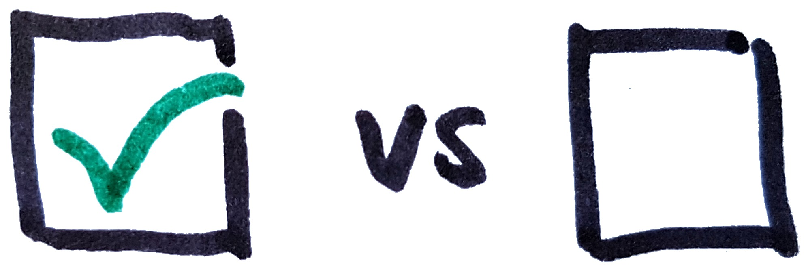

## External Resources

[Effective Java, Item 69: Use exceptions only for exceptional conditions](https://books.google.se/books?id=BIpDDwAAQBAJ)  
by Joshua Bloch

[Effective Java, Item 70: Use checked exceptions for recoverable conditions and runtime exceptions for programming errors](https://books.google.se/books?id=BIpDDwAAQBAJ)  
by Joshua Bloch

[Effective Java, Item 71: Avoid unnecessary use of checked exceptions](https://books.google.se/books?id=BIpDDwAAQBAJ)  
by Joshua Bloch

## Top Java Articles

1.  [Do interfaces inherit from Object?](do-interfaces-inherit-from-object.html)
2.  [Executing code in comments?!](executing-code-in-comments.html)
3.  [Functional Interfaces](functional-interfaces.html)
4.  [Handling InterruptedException](handling-interrupted-exceptions.html)
5.  [Why wait must be called in a synchronized block](why-wait-must-be-in-synchronized.html)

[**See all 190 Java articles**](index.html)

## Top Algorithm Articles

1.  [Dynamic programming vs memoization vs tabulation](../dynamic-programming-vs-memoization-vs-tabulation.html)
2.  [Big O notation explained](../big-o-notation-explained.html)
3.  [Sliding Window Algorithm with Example](../sliding-window-example.html)
4.  [What makes a good loop invariant?](../what-makes-a-good-loop-invariant.html)
5.  [Generating a random point within a circle (uniformly)](../random-point-within-circle.html)

# Choosing between Checked and Unchecked Exceptions

Here's a flow chart for a quick reference. Detailed explanations below.

## When is a situation "actually exceptional"?

An exceptional situation is an unexpected situation that is out of the ordinary. A situation is _not_ exceptional just because it's _less common_ than other situations. In a non-exceptional situation you should use return values instead of exceptions.

For a detailed discussion with examples, see [Return Values vs Exceptions](return-values-vs-exceptions.html).

## Can the client recover from the situation?

If the client can't reasonably be expected to recover from the situation, there's no point in forcing it to catch the exception. In such **unrecoverable situation** an **unchecked exception** should be used.

<table><colgroup><col style="width: 50%" /><col style="width: 50%" /></colgroup><tbody><tr class="odd"><td><strong>Unrecoverable Examples</strong></td><td><strong>Recoverable Examples</strong></td></tr><tr class="even"><td><ul><li>Misuse of the API</li><li>Internal error in the library</li><li>Unsupported operations</li></ul></td><td><ul><li>Network failures</li><li>USB-drive unplugged</li><li>Operation timed out</li></ul></td></tr></tbody></table>

## Is the situation predictable by the client?

If the client **can predict** or control the conditions under which a method throws an exception, then it's capable of calling the method only when it knows that it will succeed. In such cases it's wrong to force the client to wrap calls in try/catch blocks. That is, if the client can predict an exception, you should **not use a checked exception** (even if the situation is recoverable).

**Example:** `PhoneNumber.parse(String input)` returns a `PhoneNumber`, unless the input is malformed in which case it throws `PhoneNumFormatException`

The client **can predict** any exception since it controls the input to the method.

`PhoneNumFormatException` should therefore be **unchecked**.

(If a `PhoneNumFormatException` had been checked, the client would have been forced to include a catch block. This would have been nothing but annoying if the input to the method was a hardcoded valid phone number.)

**Example:** `scanImage()` uses a scanner to scan an image, or throws `NoScannerException` if no scanner is attached.

The client **can not predict** any exception, since the scanner can be unplugged at any time.

`NoScannerException` should be **checked** (since it's also reasonable to expect the client to recover).

## Conclusions

Many conditions should be met for a checked exception to be a good fit. If you only use checked exceptions in truly exceptional situations where the outcome depends on the environment rather than the application state and the client can recover gracefully you should do fine. As always when designing an API, evaluate it by putting yourself in the shoes of the client and write some code against it.

## Comments

© 2016–2021 Programming.Guide, [Terms and Conditions](../terms-and-conditions.html)
