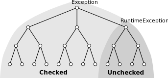

## Java Exceptions

1.  [Throw, Try and Catch](exceptions-throw-try-catch.html)
2.  [Java Exception Types](exception-types.html)
3.  [Chained Exceptions](chained-exceptions.html)
4.  Custom Exception
5.  [Difference between Checked and Unchecked Exceptions](difference-between-checked-and-unchecked-exceptions.html)
6.  [Choosing between Checked and Unchecked Exceptions](choosing-between-checked-and-unchecked-exceptions.html)
7.  [Checked Exceptions: Good or Bad?](checked-exceptions-good-or-bad.html)
8.  [Return Values vs Exceptions](return-values-vs-exceptions.html)
9.  [try + finally](try-finally.html)
10. [try-with-resources](try-with-resources.html)
11. [Stack Traces](stack-trace.html)
12. [Suppressed Exceptions](suppressed-exceptions.html)
13. [throw vs throws vs Throwable](throw-vs-throws-vs-throwable.html)
14. [List of Java Exceptions](list-of-java-exceptions.html)

## Exception Related Keywords

1.  [throw](throw.html)
2.  [throws](throws.html)
3.  [catch](catch.html)
4.  [try](try.html)
5.  [finally](finally.html)

## Featured Stack Overflow Post

[In Java, difference between default, public, protected, and private](https://stackoverflow.com/a/33627846/276052)

## Top Java Articles

1.  [Do interfaces inherit from Object?](do-interfaces-inherit-from-object.html)
2.  [Executing code in comments?!](executing-code-in-comments.html)
3.  [Functional Interfaces](functional-interfaces.html)
4.  [Handling InterruptedException](handling-interrupted-exceptions.html)
5.  [Why wait must be called in a synchronized block](why-wait-must-be-in-synchronized.html)

[**See all 190 Java articles**](index.html)

## Top Algorithm Articles

1.  [Dynamic programming vs memoization vs tabulation](../dynamic-programming-vs-memoization-vs-tabulation.html)
2.  [Big O notation explained](../big-o-notation-explained.html)
3.  [Sliding Window Algorithm with Example](../sliding-window-example.html)
4.  [What makes a good loop invariant?](../what-makes-a-good-loop-invariant.html)
5.  [Generating a random point within a circle (uniformly)](../random-point-within-circle.html)

# Java: Custom Exception

You create a custom exception by extending [`Exception`](https://docs.oracle.com/javase/8/docs/api/java/lang/Exception.html), directly or indirectly. Technically speaking you could extend any [`Throwable`](https://docs.oracle.com/javase/8/docs/api/java/lang/Throwable.html), but ordinary programs should stick to the `Exception` hierarchy. See [Java Exception Types](exception-types.html).

**Example:**

    class MyException extends Exception {
        // ...
    }

This can be used as any other exception:

    try {
        throw new MyException();
    } catch (MyException e) {
        System.out.println("Caught custom exception.");
    }

It's also customary to allow clients to specify a message and/or cause by overriding one or more [`Throwable`](https://docs.oracle.com/javase/8/docs/api/java/lang/Throwable.html) constructors. See the "real world" example at the end of the article.

## Which class to extend?

If you extend `RuntimeException` your exception will be an **unchecked** exception. Otherwise it will be a **checked** exception.

This is an important decision and you should read the following two articles to understand the implications.

- [Difference between Checked and Unchecked Exceptions](difference-between-checked-and-unchecked-exceptions.html)
- [Choosing between Checked and Unchecked Exceptions](choosing-between-checked-and-unchecked-exceptions.html)

## Use a standard exception if possible

By reusing exceptions from the standard API, either by extending it or by using it off the shelf, you get two benefits:

- As always with code reuse, you end up with less code to test and maintain

- It makes your API easier to understand, as most programmers are already familiar with the semantics of the standard exceptions

Make sure to always read the Javadoc of the exception you intend to use. Even though an exception may have a generic and fitting name, it may be intended for something specific and entirely different. Don't use a [`ZipException`](https://docs.oracle.com/javase/8/docs/api/java/util/zip/ZipException.html) for malformed Zip Codes, or an [`InvalidAddress`](https://docs.oracle.com/javase/8/docs/api/org/omg/CosNaming/NamingContextExtPackage/InvalidAddress.html) (which belongs to the CORBA package) for invalid email addresses.

Here's a [list of all Java Exceptions](list-of-java-exceptions.html).

## Real World Example

Here's an example that follows the above mentioned best practices.

**Example:** The exception below is thrown when the application fails to save the document to disk.

- It reuses the well known `IOException` from the API
- It allows clients to specify message and cause, and
- It includes information useful when handling the exception

<!-- -->

    import java.io.IOException;
    import java.nio.file.Path;

    public class SaveDocException extends IOException {

        private final Path path;

        public SaveDocException(Path path) {
            this(path, null, null);
        }

        public SaveDocException(Path path,
                                String msg) {
            this(path, msg, null);
        }

        public SaveDocException(Path path,
                                Throwable cause) {
            this(path, null, cause);
        }

        public SaveDocException(Path path,
                                String msg,
                                Throwable cause) {
            super(msg, cause);
            this.path = path;
        }

        public Path getPath() {
            return path;
        }
    }

## Comments

© 2016–2021 Programming.Guide, [Terms and Conditions](../terms-and-conditions.html)
