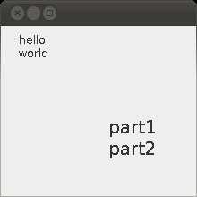

Featured Stack Overflow Post
----------------------------

[In Java, difference between default, public, protected, and private](https://stackoverflow.com/a/33627846/276052)  
  

Top Java Articles
-----------------

1.  [Do interfaces inherit from Object?](do-interfaces-inherit-from-object.html)
2.  [Executing code in comments?!](executing-code-in-comments.html)
3.  [Functional Interfaces](functional-interfaces.html)
4.  [Handling InterruptedException](handling-interrupted-exceptions.html)
5.  [Why wait must be called in a synchronized block](why-wait-must-be-in-synchronized.html)

[**See all 190 Java articles**](index.html)

Top Algorithm Articles
----------------------

1.  [Dynamic programming vs memoization vs tabulation](../dynamic-programming-vs-memoization-vs-tabulation.html)
2.  [Big O notation explained](../big-o-notation-explained.html)
3.  [Sliding Window Algorithm with Example](../sliding-window-example.html)
4.  [What makes a good loop invariant?](../what-makes-a-good-loop-invariant.html)
5.  [Generating a random point within a circle (uniformly)](../random-point-within-circle.html)

Java: Drawing multiline strings with Graphics
=============================================

The [`Graphics.drawString`](https://docs.oracle.com/javase/8/docs/api/java/awt/Graphics.html#drawString-java.lang.String-int-int-) method does not handle newline characters.

You'll have to split the string on newline characters yourself, and draw the lines one by one with a appropriate vertical offset:

    void drawString(Graphics g, String text, int x, int y) {
        int lineHeight = g.getFontMetrics().getHeight();
        for (String line : text.split("\n"))
            g.drawString(line, x, y += lineHeight);
    }

A Complete Example
------------------

This screen shot is produced with the code below:

    import javax.swing.*;
    import java.awt.*;

    class TestComponent extends JPanel {

        private void drawString(Graphics g, String text, int x, int y) {
            int lineHeight = g.getFontMetrics().getHeight();
            for (String line : text.split("\n"))
                g.drawString(line, x, y += lineHeight);
        }
        
        public void paintComponent(Graphics g) {
            super.paintComponent(g);
            drawString(g, "hello\nworld", 20, 20);
            g.setFont(g.getFont().deriveFont(20f));
            drawString(g, "part1\npart2", 120, 120);
        }
        
        public static void main(String s[]) {
            JFrame f = new JFrame();
            f.setDefaultCloseOperation(JFrame.EXIT_ON_CLOSE);
            f.add(new TestComponent());
            f.setSize(220, 220);
            f.setVisible(true);
        }
    }

Comments
--------

Be the first to comment!

© 2016–2021 Programming.Guide, [Terms and Conditions](../terms-and-conditions.html)
