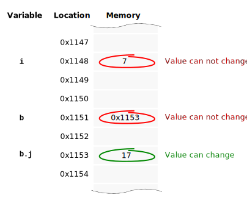

## Featured Stack Overflow Post

[In Java, difference between default, public, protected, and private](https://stackoverflow.com/a/33627846/276052)

## Top Java Articles

1.  [Do interfaces inherit from Object?](do-interfaces-inherit-from-object.html)
2.  [Executing code in comments?!](executing-code-in-comments.html)
3.  [Functional Interfaces](functional-interfaces.html)
4.  [Handling InterruptedException](handling-interrupted-exceptions.html)
5.  [Why wait must be called in a synchronized block](why-wait-must-be-in-synchronized.html)

[**See all 190 Java articles**](index.html)

## Top Algorithm Articles

1.  [Dynamic programming vs memoization vs tabulation](../dynamic-programming-vs-memoization-vs-tabulation.html)
2.  [Big O notation explained](../big-o-notation-explained.html)
3.  [Sliding Window Algorithm with Example](../sliding-window-example.html)
4.  [What makes a good loop invariant?](../what-makes-a-good-loop-invariant.html)
5.  [Generating a random point within a circle (uniformly)](../random-point-within-circle.html)

# Java: What does final mean, and are final variables always immutable?

A `final` variable can not be changed after it has been initialized.

**Example:**

    class C {
        void m() {
            final int i = 7;
            i = 55;Error: i has already been initialized.

        }
    }

So `final` in the example above, makes `i` immutable.

The exact same rules apply for reference types (`Object`, `String`, `List`, `int[]` etc). See this example:

    class IntBox {
        int j = 17;
    }

    class C {
        void m() {
            final int i = 7;
            final IntBox b = new IntBox();
        }
    }

This creates the situation depicted below (locations made up, not actual memory layout):

## So, both `i` and `b` are `final`. Are both _immutable_?

Strictly speaking, yes, since neither `i` nor `b` can change their value both are immutable. However, when you mention `b` in everyday conversation, you're rarely talking about the reference it contains, `0x1153`, but the object that the reference points to, the `IntBox` object. Since the `j` field is not final (i.e. the `IntBox` object is mutable) most people would say that `b` is also _mutable_.

You could think of it as `i` "as a whole" can not change and is therefore immutable, but `b` "as a whole" _can_ change and is therefore mutable.

## Comments

Be the first to comment!

© 2016–2021 Programming.Guide, [Terms and Conditions](../terms-and-conditions.html)
