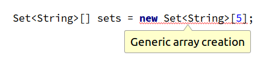

## Recommended Reading

[Generics gotchas](https://www.ibm.com/developerworks/java/library/j-jtp01255/index.html)  
by Brian Goetz

## Top Java Articles

1.  [Do interfaces inherit from Object?](do-interfaces-inherit-from-object.html)
2.  [Executing code in comments?!](executing-code-in-comments.html)
3.  [Functional Interfaces](functional-interfaces.html)
4.  [Handling InterruptedException](handling-interrupted-exceptions.html)
5.  [Why wait must be called in a synchronized block](why-wait-must-be-in-synchronized.html)

[**See all 190 Java articles**](index.html)

## Top Algorithm Articles

1.  [Dynamic programming vs memoization vs tabulation](../dynamic-programming-vs-memoization-vs-tabulation.html)
2.  [Big O notation explained](../big-o-notation-explained.html)
3.  [Sliding Window Algorithm with Example](../sliding-window-example.html)
4.  [What makes a good loop invariant?](../what-makes-a-good-loop-invariant.html)
5.  [Generating a random point within a circle (uniformly)](../random-point-within-circle.html)

# Java Error: Generic array creation

Java does not allow you to create arrays of generic classes:

## Workaround 1: Raw types

    @SuppressWarnings("unchecked")
    Set<String>[] sets = new Set[5];

## Workaround 2: Use a List instead

    List<Set<String>> sets = new ArrayList<>();

## Workaround 3: Non-generic subclass

You can create a non-generic subclass (local if you like) that extends the generic class:

    class StringHashSet extends HashSet<String> {}
    Set<String>[] sets = new StringHashSet[5];

## What's the reason for this limitation?

Let's illustrate what could happen with an example:

    // Suppose this was allowed
    Set<String>[] arr = new Set<String>[5];

    // Arrays are covariant:
    Object[] oa = arr;

    // Putting a Set<Integer> in arr!
    oa[0] = Collections.singleton(3);

    // Looks type safe but isn't!
    String s = arr[0].iterator().next();

Arrays actually have the same problem. This program **does** in fact even compile:

    String[] arr = new String[5];
    Object[] oa = arr;
    oa[0] = 5; // Eeek! An Integer in a String[]?
    String s = arr[0];

Here however, `oa[0] = 5` throws an `ArrayStoreException` in runtime. In other words, when generics were introduced the designers traded some expressiveness for some added compile time type safety.

## Comments

© 2016–2021 Programming.Guide, [Terms and Conditions](../terms-and-conditions.html)
