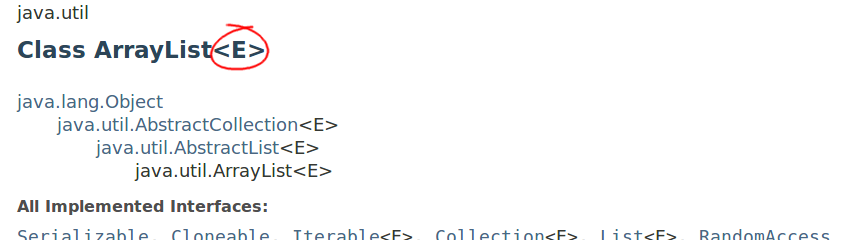
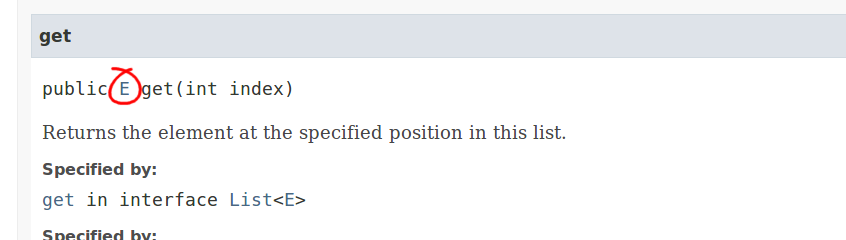

## Related

[Lesson: Generics](http://download.oracle.com/javase/tutorial/java/generics/index.html)  
The Java™ Tutorials

## Top Java Articles

1.  [Do interfaces inherit from Object?](do-interfaces-inherit-from-object.html)
2.  [Executing code in comments?!](executing-code-in-comments.html)
3.  [Functional Interfaces](functional-interfaces.html)
4.  [Handling InterruptedException](handling-interrupted-exceptions.html)
5.  [Why wait must be called in a synchronized block](why-wait-must-be-in-synchronized.html)

[**See all 190 Java articles**](index.html)

## Top Algorithm Articles

1.  [Dynamic programming vs memoization vs tabulation](../dynamic-programming-vs-memoization-vs-tabulation.html)
2.  [Big O notation explained](../big-o-notation-explained.html)
3.  [Sliding Window Algorithm with Example](../sliding-window-example.html)
4.  [What makes a good loop invariant?](../what-makes-a-good-loop-invariant.html)
5.  [Generating a random point within a circle (uniformly)](../random-point-within-circle.html)

# Java: &lt;...&gt; (less than/greater than) syntax

The `<...>` syntax allows you to write **generic** classes and methods that can handle multiple different types. This means, for instance, that you don't have to write one list class that can store integers, one list class that can store strings, and so on. Instead you can write one list class that's generic and can be used for any type.

[`ArrayList`](https://docs.oracle.com/javase/8/docs/api/java/util/ArrayList.html) does precisely this. It is parametrized on type `E`…

…which means that you can give it a **type argument** as follows:

    ArrayList<String> strList;

In this case `strList` will **only contain objects of type `String`** and something like `strList.add(5)` will fail to compile.

Looking at the documentation, we see that the [`ArrayList.get(int)`](https://docs.oracle.com/javase/8/docs/api/java/util/ArrayList.html#get-int-) method returns something of type `E`:

This means that `strList.get()` will return a `String`.

## Diamond Syntax: `new ArrayList<>()`

If the type is left out, as below, the type is **inferred**:

    List<String> l1 = new ArrayList<>();
    List<String> l2 = new ArrayList<String>(); // Equivalent

## Details

- `ArrayList` (without any type argument) is called the **raw type** and should not be used if it can be avoided.

- `ArrayList<Object>` is **not** a super type of `ArrayList<String>`. In technical terms: generic classes are **invariant** (as opposed to arrays that are **covariant**).

## Comments

© 2016–2021 Programming.Guide, [Terms and Conditions](../terms-and-conditions.html)
