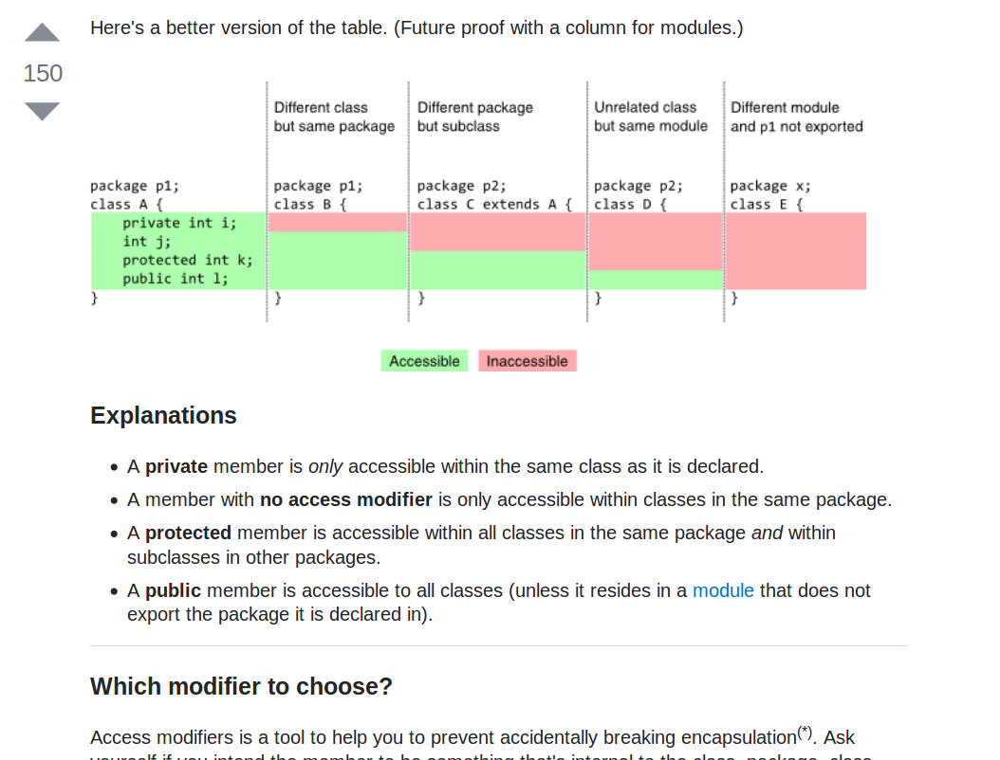

## Unsigned integers in Java

1.  [Unsigned byte](unsigned-byte.html)
2.  [Unsigned short](unsigned-short.html)
3.  Unsigned int
4.  [Unsigned long](unsigned-long.html)

## Featured Stack Overflow Post

[In Java, difference between default, public, protected, and private](https://stackoverflow.com/a/33627846/276052)

## Top Java Articles

1.  [Do interfaces inherit from Object?](do-interfaces-inherit-from-object.html)
2.  [Executing code in comments?!](executing-code-in-comments.html)
3.  [Functional Interfaces](functional-interfaces.html)
4.  [Handling InterruptedException](handling-interrupted-exceptions.html)
5.  [Why wait must be called in a synchronized block](why-wait-must-be-in-synchronized.html)

[**See all 190 Java articles**](index.html)

## Top Algorithm Articles

1.  [Dynamic programming vs memoization vs tabulation](../dynamic-programming-vs-memoization-vs-tabulation.html)
2.  [Big O notation explained](../big-o-notation-explained.html)
3.  [Sliding Window Algorithm with Example](../sliding-window-example.html)
4.  [What makes a good loop invariant?](../what-makes-a-good-loop-invariant.html)
5.  [Generating a random point within a circle (uniformly)](../random-point-within-circle.html)

# Unsigned int in Java

Java does not have unsigned data types. Your options are:

- Use a `long`
- Use an [`UnsignedInteger`](https://guava.dev/releases/snapshot-jre/api/docs/com/google/common/primitives/UnsignedInteger.html) from Guava
- Use an `int` and interpret the bits as unsigned (described below)

## An unsigned `int`

An `int` is always signed in Java, but nothing prevents you from viewing an `int` simply as 32 bits and interpret those bits as a value between 0 and 264.

<table><thead><tr class="header"><th style="text-align: center;">Java int value</th><th style="text-align: center;">Bits</th><th style="text-align: center;">Interpreted as unsigned</th></tr></thead><tbody><tr class="odd"><td style="text-align: center;">0</td><td style="text-align: center;"><code>00000000…00000000</code></td><td style="text-align: center;">0</td></tr><tr class="even"><td style="text-align: center;">1</td><td style="text-align: center;"><code>00000000…00000001</code></td><td style="text-align: center;">1</td></tr><tr class="odd"><td style="text-align: center;">⋮</td><td style="text-align: center;">⋮</td><td style="text-align: center;">⋮</td></tr><tr class="even"><td style="text-align: center;">2,147,483,647</td><td style="text-align: center;"><code>01111111…11111111</code></td><td style="text-align: center;">2,147,483,647</td></tr><tr class="odd"><td style="text-align: center;">−2,147,483,648</td><td style="text-align: center;"><code>10000000…00000000</code></td><td style="text-align: center;">2,147,483,648</td></tr><tr class="even"><td style="text-align: center;">⋮</td><td style="text-align: center;">⋮</td><td style="text-align: center;">⋮</td></tr><tr class="odd"><td style="text-align: center;">−2</td><td style="text-align: center;"><code>11111111…11111110</code></td><td style="text-align: center;">4,294,967,294</td></tr><tr class="even"><td style="text-align: center;">−1</td><td style="text-align: center;"><code>11111111…11111111</code></td><td style="text-align: center;">4,294,967,295</td></tr></tbody></table>

Keep in mind that there’s nothing you can do to force your interpretation upon someone else’s method. If a method accepts a `int`, then that method accepts a value between −231 and 231 − 1 unless explicitly stated otherwise.

Here are a couple of useful conversions / manipulations.

## Printing an unsigned `int`

Use [`Integer.toUnsignedString`](https://docs.oracle.com/javase/8/docs/api/java/lang/Integer.html#toUnsignedString-int-):

    System.out.println("Value of my unsigned int: " + Integer.toUnsignedString(uint));

## Converting from `long` to unsigned `int`

Casting to `int` throws away all but the lowest 32 bits.

    long lng = 2200000000L;  // 00000000 ... 00000000 10000011 00100001 01010110 00000000
    int i = (int) lng;       //                       10000011 00100001 01010110 00000000

    System.out.println(i);                            // -2094967296
    System.out.println(Integer.toUnsignedString(i));  // 2200000000

## Converting from unsigned `int` to `long`

Use [`Integer.toUnsignedLong`](https://docs.oracle.com/javase/8/docs/api/java/lang/Integer.html#toUnsignedLong-int-) to avoid [sign extension](https://en.wikipedia.org/wiki/Sign_extension).

    int i = 0b10000011001000010101011000000000;  // -2094967296 or 2200000000

    long signed = i;                             // -2094967296 (with sign extension)
    long unsigned = Integer.toUnsignedLong(i);   //  2200000000 (without sign extension)

Or, equivalently:

    long unsigned = i & 0xffffffffL;

## Comparing unsigned `int`s

    int cmp = Integer.compareUnsigned(i1, i2);
    // cmp = -1  =>  i1 < i2
    // cmp =  0  =>  i1 = i2
    // cmp =  1  =>  11 > i2

## Parsing an unsigned `int`

    int i = Integer.parseUnsignedInt("2200000000");

    System.out.println(Integer.toUnsignedString(i)); // 2200000000

**Note:** [`Integer.parseInt`](https://docs.oracle.com/javase/8/docs/api/java/lang/Integer.html#parseInt-java.lang.String-) would throw a [`NumberFormatException`](https://docs.oracle.com/javase/8/docs/api/java/lang/NumberFormatException.html) for the above input.

## Arithmetics

As it happens, the 2-complement representation “just works” for addition, subtraction and multiplication.

    // two unsigned ints
    int i1 = (int) 2200000000L;
    int i2 = 55555;

    int sum  = i1 + i2;  // 2200055555
    int diff = i1 - i2;  // 2199944445
    int prod = i2 * i2;  // 3086358025

For division and remainder, use [`Integer.divideUnsigned`](https://docs.oracle.com/javase/8/docs/api/java/lang/Integer.html#divideUnsigned-int-int-) and [`Integer.remainderUnsigned`](https://docs.oracle.com/javase/8/docs/api/java/lang/Integer.html#remainderUnsigned-int-int-):

    int q = Integer.divideUnsigned(i1, i2);     // 39600
    int r = Integer.remainderUnsigned(i1, i2);  // 22000

## Comments

Be the first to comment!

© 2016–2021 Programming.Guide, [Terms and Conditions](../terms-and-conditions.html)
