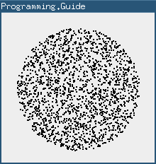

## Related articles

[Generating a random value with a custom distribution](generate-random-value-with-distribution.html)  
Programming.Guide

## Top Algorithm Articles

1.  [Dynamic programming vs memoization vs tabulation](dynamic-programming-vs-memoization-vs-tabulation.html)
2.  [Big O notation explained](big-o-notation-explained.html)
3.  [Sliding Window Algorithm with Example](sliding-window-example.html)
4.  [What makes a good loop invariant?](what-makes-a-good-loop-invariant.html)
5.  Generating a random point within a circle (uniformly)

[**See all algorithm articles**](algorithms.html)

## Top Java Articles

1.  [Do interfaces inherit from Object?](java/do-interfaces-inherit-from-object.html)
2.  [Executing code in comments?!](java/executing-code-in-comments.html)
3.  [Functional Interfaces](java/functional-interfaces.html)
4.  [Handling InterruptedException](java/handling-interrupted-exceptions.html)
5.  [Why wait must be called in a synchronized block](java/why-wait-must-be-in-synchronized.html)

[**See all Java articles**](java/index.html)

# Generating a random point within a circle (uniformly)

For a circle of radius `R` you do:

    double a = random() * 2 * PI
    double r = R * sqrt(random())

    // If you need it in Cartesian coordinates
    double x = r * cos(a)
    double y = r * sin(a)

where `random()` gives a uniformly random number between 0 and 1.

## Why `sqrt(random())`?

Let's look at the math that leads up to `sqrt(random())`. Assume for simplicity that we're working with the unit circle, i.e. *R* = 1.

The average distance between points should be the same regardless of how far from the center we look. This means for example, that looking on the perimeter of a circle with circumference 2 we should find twice as many points as the number of points on the perimeter of a circle with circumference 1.

Twice as long circumference ⇓ Twice as many points needed to maintain the same density

Since the circumference of a circle (2π*r*) grows linearly with _r_, it follows that the number of random points should grow linearly with _r_. In other words, the desired [probability density function](https://en.wikipedia.org/wiki/Probability_density_function) (PDF) grows linearly. Since a PDF should have an area equal to 1 and the maximum radius is 1, we have

0 1 2 PDF(x) = 2x

So we know how the desired density of our random values should look like. Now: **How do we generate such random values when all we have is a function that produces values between 0 and 1?**

We use a trick called [inverse transform sampling](https://en.wikipedia.org/wiki/Inverse_transform_sampling). An intuitive explanation of how this method works can be found here: [Generating a random value with a custom distribution](generate-random-value-with-distribution.html).

Step 1: Create the [cumulative distribution function](https://en.wikipedia.org/wiki/Cumulative_distribution_function) (CDF)  
The CDF is, as the name suggests, the cumulative version of the PDF. Since we're working with reals, the CDF is expressed as an integral.

_CDF_(_x_) = ∫*PDF* = ∫2*x* = _x_2

Step 2: Mirror the CDF along _y_ = _x_  
Mathematically this boils down to swapping _x_ and _y_ and solving for _y_:

_CDF_:_y_ = _x_2  
Swap:_x_ = _y_2  
Solve:_y_ = √*x*  
_CDF_-1:_y_ = √*x*

Step 3: Apply the resulting function to a uniform value between 0 and 1  
_CDF_-1(random()) = √random()

And that's where `sqrt(random())` comes from.

## Comments

Be the first to comment!

© 2016–2021 Programming.Guide, [Terms and Conditions](terms-and-conditions.html)
